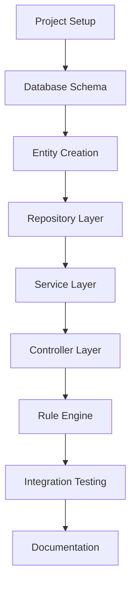
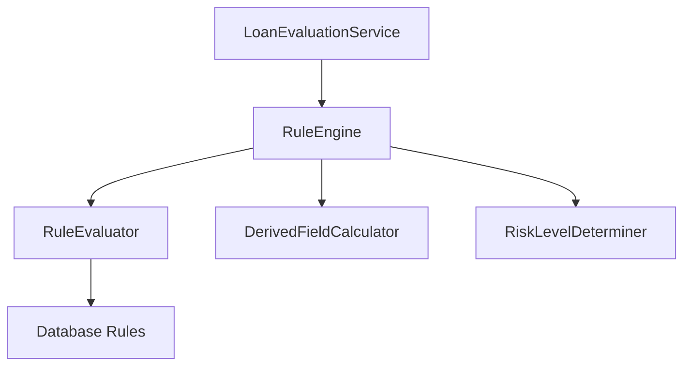

# Loan Risk Scoring Engine Implementation Plan

## Overview

This plan outlines the step-by-step implementation of a Spring Boot microservice that evaluates loan applications using a dynamic, database-driven rule engine. The implementation will follow a test-driven approach, with tests run after each step.



## Phase 1: Project Setup and Configuration

### Step 1.1: Configure Database Properties
- Update `application.properties` for H2 database configuration
- Add PostgreSQL dependency in `pom.xml`
- Create separate profiles for development and testing
- **Test**: Run `./mvnw test` to verify configuration loads correctly
- **Commit**: Initial database configuration

### Step 1.2: Configure Logging and Error Handling
- Set up logging configuration
- Create global exception handler
- Create custom exceptions
- **Test**: Run `./mvnw test` to verify error handling
- **Commit**: Logging and error handling setup

## Phase 2: Database Schema Design and Implementation

### Step 2.1: Create Database Schema
- Create SQL schema for Customer table
- Create SQL schema for LoanApplication table
- Create SQL schema for ScoringRule table
- **Test**: Run `./mvnw test` to verify schema creation
- **Commit**: Database schema creation

### Step 2.2: Create Database Migration Scripts
- Set up Flyway for database migrations
- Create initial migration script with schema
- Create migration script for initial scoring rules
- **Test**: Run `./mvnw test` to verify migrations run successfully
- **Commit**: Database migration setup

## Phase 3: Entity Creation

### Step 3.1: Create Customer Entity
- Create Customer class with all required fields
- Add JPA annotations
- Add validation annotations
- Create unit tests for Customer entity
- **Test**: Run `./mvnw test` to verify entity and tests
- **Commit**: Customer entity implementation

### Step 3.2: Create LoanApplication Entity
- Create LoanApplication class with all required fields
- Add JPA annotations
- Add validation annotations
- Create unit tests for LoanApplication entity
- **Test**: Run `./mvnw test` to verify entity and tests
- **Commit**: LoanApplication entity implementation

### Step 3.3: Create ScoringRule Entity
- Create ScoringRule class with all required fields
- Add JPA annotations
- Add validation annotations
- Create unit tests for ScoringRule entity
- **Test**: Run `./mvnw test` to verify entity and tests
- **Commit**: ScoringRule entity implementation

### Step 3.4: Create DTOs
- Create DTOs for Customer (request/response)
- Create DTOs for LoanApplication (request/response)
- Create DTOs for ScoringRule (response only)
- Create unit tests for DTOs
- **Test**: Run `./mvnw test` to verify DTOs and tests
- **Commit**: DTO implementation

## Phase 4: Repository Implementation

### Step 4.1: Create Customer Repository
- Create CustomerRepository interface
- Add custom query methods if needed
- Create unit tests for repository
- **Test**: Run `./mvnw test` to verify repository and tests
- **Commit**: Customer repository implementation

### Step 4.2: Create LoanApplication Repository
- Create LoanApplicationRepository interface
- Add custom query methods if needed
- Create unit tests for repository
- **Test**: Run `./mvnw test` to verify repository and tests
- **Commit**: LoanApplication repository implementation

### Step 4.3: Create ScoringRule Repository
- Create ScoringRuleRepository interface
- Add methods to find enabled rules
- Add methods to find rules by priority
- Create unit tests for repository
- **Test**: Run `./mvnw test` to verify repository and tests
- **Commit**: ScoringRule repository implementation

## Phase 5: Service Layer Implementation

### Step 5.1: Create Customer Service
- Create CustomerService interface
- Create CustomerServiceImpl class
- Implement methods for CRUD operations
- Create unit tests for service
- **Test**: Run `./mvnw test` to verify service and tests
- **Commit**: Customer service implementation

### Step 5.2: Create LoanApplication Service
- Create LoanApplicationService interface
- Create LoanApplicationServiceImpl class
- Implement methods for CRUD operations
- Create unit tests for service
- **Test**: Run `./mvnw test` to verify service and tests
- **Commit**: LoanApplication service implementation

### Step 5.3: Create ScoringRule Service
- Create ScoringRuleService interface
- Create ScoringRuleServiceImpl class
- Implement methods for retrieving rules
- Create unit tests for service
- **Test**: Run `./mvnw test` to verify service and tests
- **Commit**: ScoringRule service implementation

## Phase 6: Rule Engine Implementation

### Step 6.1: Create Rule Engine Core
- Create RuleEngine interface
- Create RuleEngineImpl class
- Implement rule evaluation logic
- Create unit tests for rule engine
- **Test**: Run `./mvnw test` to verify rule engine and tests
- **Commit**: Rule engine core implementation

### Step 6.2: Create Rule Evaluator
- Create RuleEvaluator interface
- Create implementations for different operators (equals, less than, greater than, etc.)
- Create factory for creating appropriate evaluator
- Create unit tests for evaluators
- **Test**: Run `./mvnw test` to verify evaluators and tests
- **Commit**: Rule evaluator implementation

### Step 6.3: Create Derived Field Calculator
- Create DerivedFieldCalculator interface
- Implement calculations for derived fields (loanRatio, existingDebtRatio, etc.)
- Create unit tests for calculator
- **Test**: Run `./mvnw test` to verify calculator and tests
- **Commit**: Derived field calculator implementation

### Step 6.4: Create Risk Level Determiner
- Create RiskLevelDeterminer class
- Implement logic to determine risk level based on score
- Implement logic to determine decision based on risk level
- Create unit tests for determiner
- **Test**: Run `./mvnw test` to verify determiner and tests
- **Commit**: Risk level determiner implementation

### Step 6.5: Create Loan Evaluation Service
- Create LoanEvaluationService interface
- Create LoanEvaluationServiceImpl class
- Integrate rule engine, evaluator, calculator, and determiner
- Create unit tests for service
- **Test**: Run `./mvnw test` to verify service and tests
- **Commit**: Loan evaluation service implementation

## Phase 7: Controller Implementation

### Step 7.1: Create Customer Controller
- Create CustomerController class
- Implement endpoints for creating and fetching customers
- Create integration tests for controller
- **Test**: Run `./mvnw test` to verify controller and tests
- **Commit**: Customer controller implementation

### Step 7.2: Create Loan Application Controller
- Create LoanApplicationController class
- Implement endpoints for submitting and fetching loan applications
- Create integration tests for controller
- **Test**: Run `./mvnw test` to verify controller and tests
- **Commit**: Loan application controller implementation

### Step 7.3: Create Scoring Rule Controller
- Create ScoringRuleController class
- Implement endpoint for retrieving active scoring rules
- Create integration tests for controller
- **Test**: Run `./mvnw test` to verify controller and tests
- **Commit**: Scoring rule controller implementation

## Phase 8: Integration Testing

### Step 8.1: Create End-to-End Tests
- Create test for customer creation and retrieval flow
- Create test for loan application submission and evaluation flow
- Create test for rule retrieval flow
- **Test**: Run `./mvnw test` to verify end-to-end tests
- **Commit**: End-to-end tests implementation

### Step 8.2: Create Performance Tests
- Create performance tests for rule engine
- Create performance tests for loan evaluation
- **Test**: Run `./mvnw test` to verify performance tests
- **Commit**: Performance tests implementation

## Phase 9: Documentation and Finalization

### Step 9.1: Create API Documentation
- Set up Springdoc OpenAPI
- Document all endpoints
- Create example requests and responses
- **Test**: Run `./mvnw test` to verify documentation generation
- **Commit**: API documentation implementation

### Step 9.2: Create README
- Document project structure
- Document how to run the application
- Document how to run tests
- Document API endpoints
- **Commit**: README implementation

### Step 9.3: Final Review and Testing
- Review all code
- Run all tests
- Fix any issues
- **Test**: Run `./mvnw test` to verify all tests pass
- **Commit**: Final review and fixes

## Testing Strategy

The testing strategy for this project will include:

1. **Unit Tests**:
   - Test individual components in isolation
   - Mock dependencies
   - Focus on business logic

2. **Integration Tests**:
   - Test interactions between components
   - Use in-memory database
   - Verify correct data flow

3. **End-to-End Tests**:
   - Test complete flows from API to database and back
   - Verify system behavior as a whole

4. **Performance Tests**:
   - Test rule engine performance
   - Test loan evaluation performance
   - Ensure system can handle expected load

## Rule Engine Design

The rule engine will be implemented using the following approach:



1. **RuleEngine**: Core component that orchestrates rule evaluation
2. **RuleEvaluator**: Evaluates individual rules based on their operator
3. **DerivedFieldCalculator**: Calculates derived fields like loanRatio
4. **RiskLevelDeterminer**: Determines risk level and decision based on score

This design allows for:
- Loading rules dynamically from the database
- Evaluating rules against customer and loan application data
- Calculating a risk score based on triggered rules
- Determining risk level and decision based on the score

## Package Structure

```
com.loanrisk
├── config
│   ├── DatabaseConfig.java
│   └── ErrorHandlingConfig.java
├── controller
│   ├── CustomerController.java
│   ├── LoanApplicationController.java
│   └── ScoringRuleController.java
├── dto
│   ├── CustomerDto.java
│   ├── LoanApplicationDto.java
│   └── ScoringRuleDto.java
├── entity
│   ├── Customer.java
│   ├── LoanApplication.java
│   └── ScoringRule.java
├── exception
│   ├── CustomException.java
│   └── GlobalExceptionHandler.java
├── repository
│   ├── CustomerRepository.java
│   ├── LoanApplicationRepository.java
│   └── ScoringRuleRepository.java
├── service
│   ├── CustomerService.java
│   ├── LoanApplicationService.java
│   ├── LoanEvaluationService.java
│   └── ScoringRuleService.java
└── engine
    ├── RuleEngine.java
    ├── RuleEvaluator.java
    ├── DerivedFieldCalculator.java
    └── RiskLevelDeterminer.java
```

## Implementation Timeline

| Phase | Estimated Time |
|-------|---------------|
| Project Setup | 1 day |
| Database Schema | 1 day |
| Entity Creation | 2 days |
| Repository Implementation | 1 day |
| Service Layer Implementation | 2 days |
| Rule Engine Implementation | 3 days |
| Controller Implementation | 2 days |
| Integration Testing | 2 days |
| Documentation and Finalization | 1 day |
| **Total** | **15 days** |